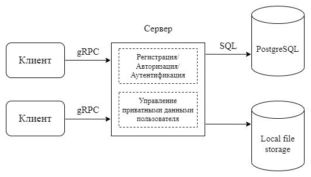

# Design Project

## Функциональность клиента

Клиент будет предоставлять возможность просмотра, добавления, редактирования и удаления данных следующего формата:  
- пары логин/пароль;
- произвольные текстовые данные;
- данные банковских карт.

Также будет предоставлена возможность отправки файлов на сервер и последующей загрузке их на клиентское устройство.
Для выполнения действия с пользовательскими данными необходимо постоянное интернет-соединение с сервером. Просмотр информации без соединения с сервером невозможен, исключая ранее сохраненные файлы.

## Протокол взаимодействия

Взаимодействия клиента и сервера будет реализовано с использованием gRPC.

## Метод аутентификации

Аутентификация будет производится при помощи JSON Web Token, генерируемого сервером на этапе регистрации/авторизации и передаваемого клиентом серверу при выполнении запросов на управление приватными данными в метаданных с ключом "token".

## Схема компонентов

## Способ синхронизации клиента и сервера

Синхронизация клиента с сервером для получения актуальных данных будет осуществляться по требованию, то есть клиент будет запрашивать актуальные данные в ответ на открытие пользователем раздела, отображающего эти данные, а также после выполнения запросов на управление этими данными.

## Взаимодействие клиента и сервера при нескольких активных клиентах

### Одновременная регистрация

### Одновременная авторизация

### Одновременное добавление идентичных данных

### Одновременное изменение идентичных данных

### Одновременное изменение и удаление данных

